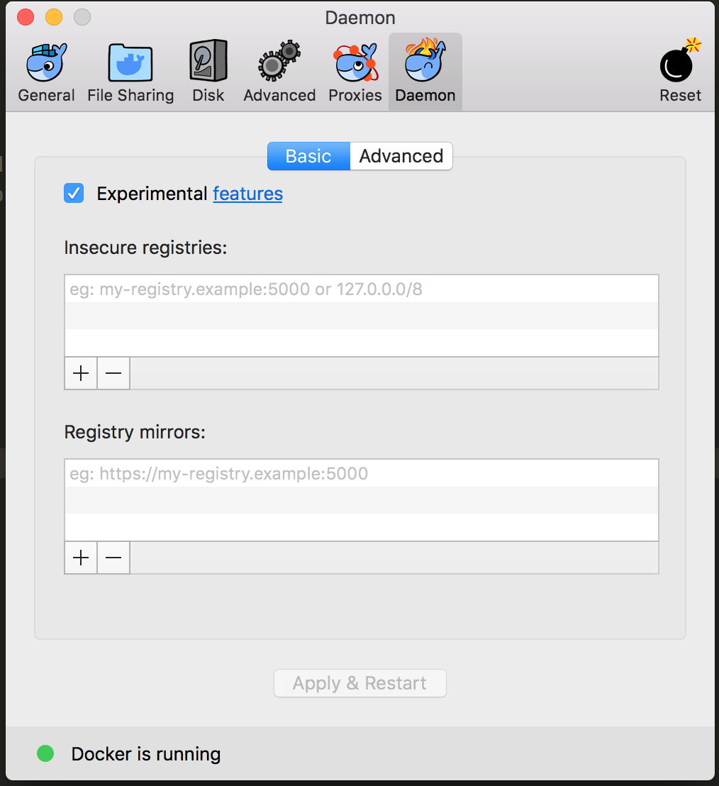

# mac install

## download for mac
1. 安装好了之后，就会有 docker / docker-compose
2. 测试一下
```bash
docker --version
docker-compose --version

# Docker version 18.03.0-ce, build 0520e24
# docker-compose version 1.20.1, build 5d8c71b
```

## check if started
```shell
docker info
```

## registry mirrors 加速
